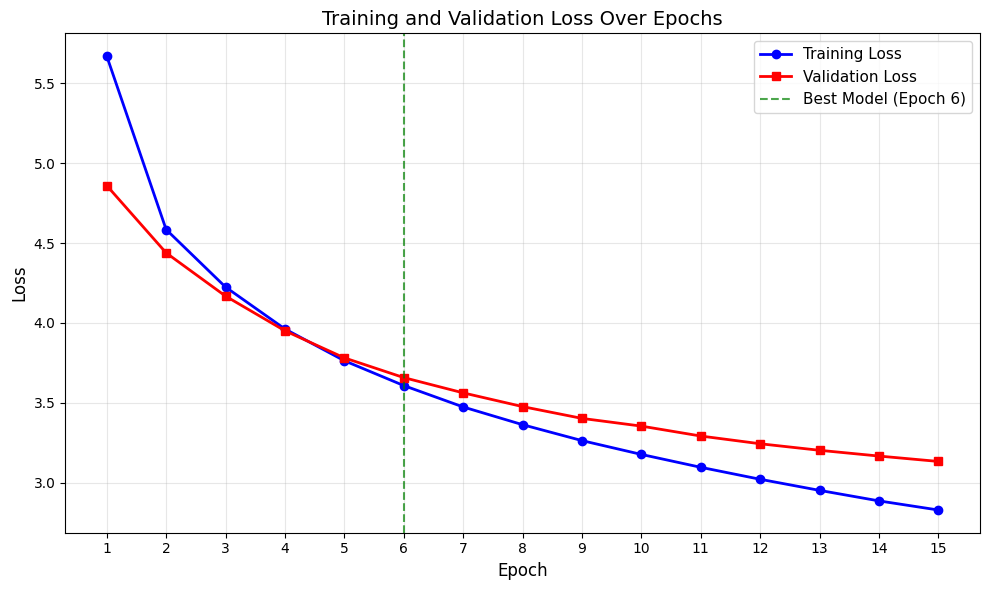
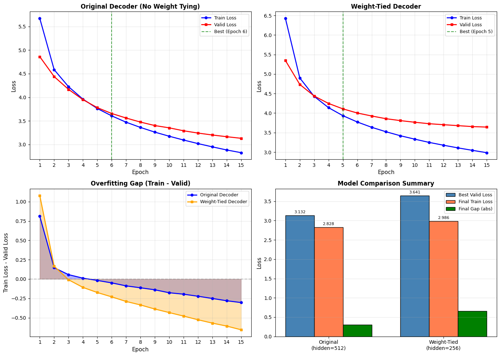
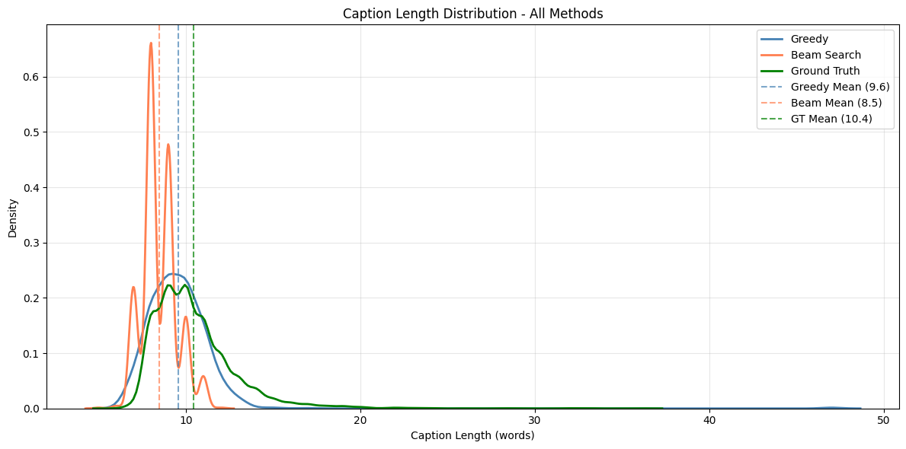
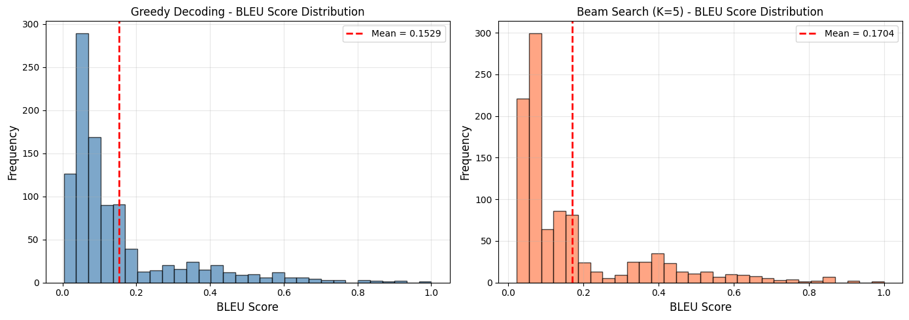
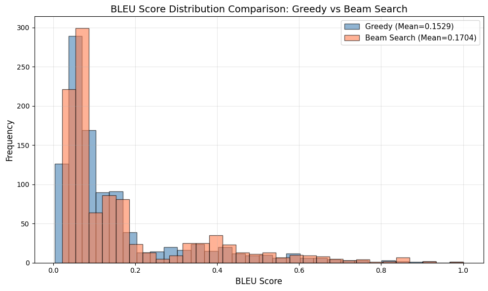
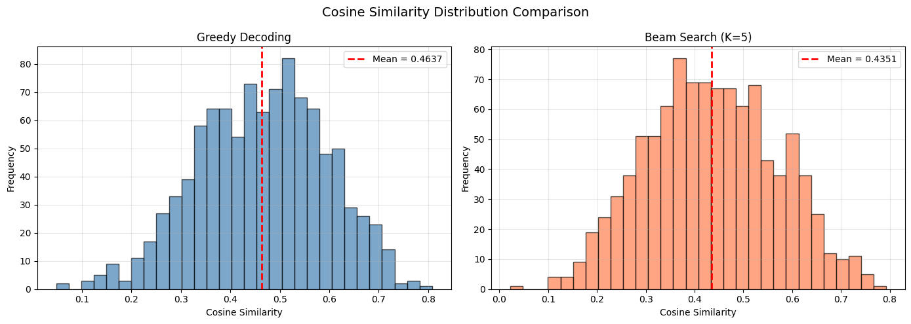
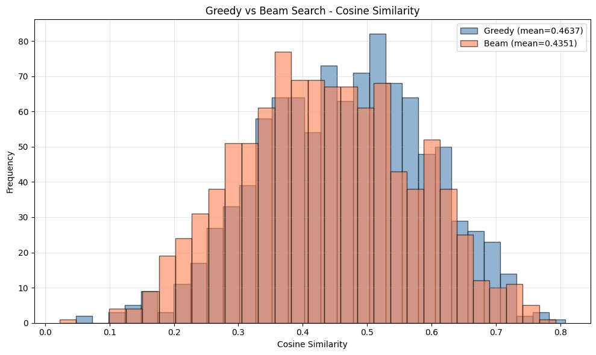
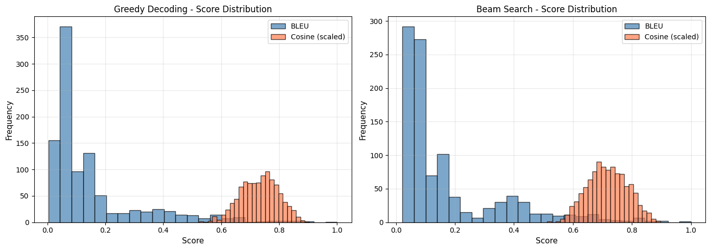

# 🖼️ Image Caption Generation with CNN-LSTM

A deep learning project that automatically generates natural language descriptions for images using an Encoder-Decoder architecture. The encoder (ResNet-152) extracts visual features and the decoder (LSTM) generates captions word-by-word. Evaluated on a COCO subset using BLEU and cosine similarity metrics.

[](https://www.python.org/downloads/)
[](https://pytorch.org/)
[](https://cocodataset.org/)
[](https://opensource.org/licenses/MIT)

## 📊 Project Poster


## 🏗️ Architecture


The model follows an **Encoder-Decoder** framework:

1. **Encoder (CNN):** A pretrained ResNet-152 extracts a 2048-dimensional feature vector from each image
2. **Decoder (LSTM):** Takes the image features and generates a caption one word at a time
3. **Decoding:** Supports both greedy and beam search (K=5) strategies

## 📋 Table of Contents

- [📊 Project Poster](#-project-poster)
- [🏗️ Architecture](#️-architecture)
- [🎯 Overview](#-overview)
- [✨ Features](#-features)
- [📦 Dataset](#-dataset)
- [🚀 Installation](#-installation)
- [💻 Usage](#-usage)
- [📁 Project Structure](#-project-structure)
- [🧠 Model Details](#-model-details)
- [📊 Results](#-results)
- [📏 Caption Length Analysis](#-caption-length-analysis)
- [📐 Evaluation Metrics](#-evaluation-metrics)
- [🔬 BLEU vs Cosine Similarity](#-bleu-vs-cosine-similarity)
- [👨‍💻 Author](#-author)
- [🔮 Future Improvements](#-future-improvements)
- [📚 References](#-references)

## 🎯 Overview

This project implements an end-to-end image captioning pipeline trained on a subset of the COCO 2017 dataset. The system encodes images using a frozen ResNet-152 CNN and decodes captions using a trained LSTM network. Two decoding strategies are compared: greedy search and beam search (K=5).

The project demonstrates best practices in:

- **Feature Extraction:** Leveraging pretrained CNNs (ResNet-152) for rich visual representations
- **Sequence Modeling:** LSTM-based language generation with packed sequences
- **Model Optimization:** Weight tying to reduce parameters by 57.8%
- **Evaluation:** Multi-metric assessment using both BLEU and cosine similarity

## ✨ Features

- 🔍 **Data Pipeline**
  - COCO 2017 caption loading and filtering
  - Text cleaning (lowercase, alphabet-only)
  - Frequency-based vocabulary building (2,410 words)
  - Custom PyTorch Dataset with packed sequence support

- 🧠 **Dual Decoder Architectures**
  - Standard DecoderRNN (3.95M parameters)
  - Weight-tied DecoderRNN (1.67M parameters, 57.8% reduction)
  - Gradient clipping for stable training

- 🔎 **Two Decoding Strategies**
  - Greedy decoding (fast, selects top-1 word)
  - Beam search decoding (K=5, explores multiple candidates)

- 📊 **Comprehensive Evaluation**
  - BLEU-4 score with smoothing
  - Cosine similarity via averaged word embeddings
  - Caption length distribution analysis
  - Side-by-side metric comparison

## 📦 Dataset

The project uses a curated subset of the **COCO 2017 Training Set**:

| Split | Images | Captions | Percentage |
|-------|--------|----------|------------|
| Train | 3,520 | 17,606 | 70% |
| Validation | 503 | 2,515 | 10% |
| Test | 1,006 | 5,033 | 20% |
| **Total** | **5,029** | **25,154** | **100%** |

- ~5 reference captions per image
- Images resized to 224x224 and normalized with ImageNet statistics
- Vocabulary built from train+validation sets only (words appearing >3 times)

### Data Directory

```
Data/
├── images/                          # COCO images (e.g., 000000262145.jpg)
├── annotations/
│   └── captions_train2017.json      # COCO captions annotation file
└── coco_subset_meta.csv             # Metadata CSV with image IDs and filenames
```

## 🚀 Installation

### Prerequisites

- Python 3.8 or higher
- pip package manager
- 8GB+ RAM recommended
- GPU optional (speeds up feature extraction)

### Setup

1. **Clone the repository**

```bash
git clone https://github.com/SalemAlnaqbi/Image-Caption-Generation.git
cd Image-Caption-Generation
```

2. **Create virtual environment** (recommended)

```bash
python -m venv venv
source venv/bin/activate  # On Windows: venv\Scripts\activate
```

3. **Install dependencies**

```bash
pip install torch torchvision
pip install pandas numpy matplotlib seaborn
pip install nltk tqdm pillow
```

4. **Download NLTK data**

```python
import nltk
nltk.download('punkt')
```

5. **Prepare the dataset**
   - Place COCO images in `Data/images/`
   - Place `captions_train2017.json` in `Data/annotations/`
   - Place `coco_subset_meta.csv` in `Data/`

## 💻 Usage

The entire pipeline runs through the Jupyter notebook:

```bash
jupyter notebook Image_Caption_Generation.ipynb
```

### Pipeline Steps

| Step | Section | Description |
|------|---------|-------------|
| 1 | **Feature Extraction** | Extract 2048-dim features from all images using ResNet-152 |
| 2 | **Text Preparation** | Clean captions, build vocabulary, create DataLoaders |
| 3 | **Train Decoder** | Train LSTM decoder with cross-entropy loss (15 epochs) |
| 4 | **Generate Captions** | Produce captions using greedy and beam search |
| 5 | **Length Analysis** | Compare caption length distributions |
| 6 | **BLEU Evaluation** | Compute BLEU-4 scores on test set |
| 7 | **Cosine Evaluation** | Compute cosine similarity on test set |
| 8 | **Metric Comparison** | Compare BLEU vs cosine similarity behavior |

## 📁 Project Structure

```
Image-Caption-Generation/
├── Data/
│   ├── images/                       # COCO subset images (5,029 images)
│   ├── annotations/
│   │   └── captions_train2017.json   # COCO captions
│   └── coco_subset_meta.csv          # Image metadata
├── results/                          # Plots and visualizations
│   ├── architecture.png              # Encoder-decoder diagram
│   ├── training_loss.png             # Training/validation loss curves
│   ├── weight_tying_comparison.png   # Original vs weight-tied comparison
│   ├── greedy_samples.png            # Greedy decoding sample outputs
│   ├── beam_search_samples.png       # Beam search sample outputs
│   ├── caption_length_distribution.png
│   ├── bleu_greedy_hist.png          # BLEU score distribution (greedy)
│   ├── bleu_beam_hist.png            # BLEU score distribution (beam)
│   ├── bleu_examples.png             # High/low BLEU examples
│   ├── cosine_greedy_hist.png        # Cosine similarity distribution (greedy)
│   ├── cosine_beam_hist.png          # Cosine similarity distribution (beam)
│   ├── cosine_examples.png           # High/low cosine examples
│   ├── bleu_vs_cosine.png            # Side-by-side metric comparison
│   └── metric_agreement.png          # Agreement/disagreement examples
├── Image_Caption_Generation.ipynb    # Main notebook (full pipeline)
├── features.pt                       # Extracted image features (generated)
├── decoder.pth                       # Trained decoder weights (generated)
├── decoder_tied.pth                  # Trained weight-tied decoder (generated)
├── encoder_decoder_diagramv2022.png  # Architecture diagram source
└── README.md                         # This file
```

## 🧠 Model Details

### EncoderCNN (Frozen)

- **Base model:** ResNet-152 pretrained on ImageNet
- **Modification:** Final FC layer removed
- **Output:** 2048-dimensional feature vector per image
- **Note:** Weights are frozen; features extracted once and cached to disk

### DecoderRNN (Trainable)

```
Image Features (2048)
 ↓
Linear (2048 → 256) + BatchNorm1d
 ↓
Embedding (2410 × 256)     ← caption words
 ↓
LSTM (input=256, hidden=512, layers=1)
 ↓
Linear (512 → 2410)
 ↓
Output (word probabilities)
```

### DecoderRNN with Weight Tying

```
Image Features (2048)
 ↓
Linear (2048 → 256) + BatchNorm1d
 ↓
Embedding (2410 × 256)     ← caption words
 ↓                              ↑ (shared weights)
LSTM (input=256, hidden=256) ↓
 ↓
Linear (256 → 2410)        ← tied to Embedding
 ↓
Output (word probabilities)
```

| Model | Parameters | Hidden Size | Best Val Loss |
|-------|-----------|-------------|---------------|
| **DecoderRNN** | 3,955,306 | 512 | 3.1324 |
| **DecoderRNN (Tied)** | 1,668,352 | 256 | 3.6414 |

### Training Configuration

| Hyperparameter | Value |
|---------------|-------|
| Epochs | 15 |
| Learning Rate | 0.0001 |
| Batch Size | 64 |
| Optimizer | Adam |
| Loss Function | CrossEntropyLoss |
| Gradient Clipping | max_norm = 5.0 |
| Embedding Size | 256 |
| Hidden Size | 512 (original) / 256 (tied) |
| Max Sequence Length | 47 |

## 📊 Results

### Training Curves



Both training and validation loss decrease steadily over 15 epochs. The gap between them indicates slight overfitting, but validation loss continues to improve throughout training.

### Original vs Weight-Tied Decoder



The original decoder (hidden=512) outperforms the weight-tied variant (hidden=256). While weight tying reduces parameters by 57.8%, the forced reduction in hidden size hurts capacity more than sharing helps generalization.


## 📏 Caption Length Analysis



| Caption Type | Min | Median | Mean | Max | Std |
|-------------|-----|--------|------|-----|-----|
| Greedy | 6 | 9.0 | 9.56 | 47 | 2.20 |
| Beam Search | 5 | 8.0 | 8.48 | 12 | 1.00 |
| Ground Truth | 6 | 10.0 | 10.45 | 36 | 2.38 |

**Key observations:**
- Ground truth captions are longest on average (10.45 words) - humans write more detailed descriptions
- Beam search produces shorter, more uniform captions (std=1.00) due to probability multiplication bias
- Greedy occasionally produces very long captions (max=47) when it fails to generate the `<end>` token

## 📐 Evaluation Metrics

### BLEU-4 Score




| Method | Mean | Median | Std |
|--------|------|--------|-----|
| Greedy | 0.1529 | 0.0786 | 0.1640 |
| Beam Search | 0.1704 | 0.0811 | 0.1810 |

Beam search achieves **11% higher** mean BLEU score than greedy decoding.

### Cosine Similarity




| Method | Mean | Std |
|--------|------|-----|
| Greedy | 0.4637 | 0.1294 |
| Beam Search | 0.4351 | 0.1334 |

Greedy decoding achieves **2% higher** mean cosine similarity than beam search.


## 🔬 BLEU vs Cosine Similarity



| Metric | Greedy | Beam Search | Winner |
|--------|--------|-------------|--------|
| BLEU-4 | 0.1529 | 0.1704 | Beam (+11%) |
| Cosine (scaled) | 0.7318 | 0.7175 | Greedy (+2%) |


**Key Findings:**

- **BLEU** is strict and measures exact n-gram matches. It rewards captions that use the same words as references but gives zero credit to valid synonyms
- **Cosine similarity** is more forgiving and captures semantic meaning through word embeddings. It can recognize that "dog" and "canine" are related
- The metrics sometimes **disagree** - a caption with many `<unk>` tokens can score high on cosine (if known words are semantically close) but low on BLEU (no exact matches)
- Neither metric alone is sufficient; using both provides a more complete picture of caption quality
## 👨‍💻 Author

**Salem Alnaqbi**

- GitHub: [@SalemAlnaqbi](https://github.com/SalemAlnaqbi)
- LinkedIn: [salemalnaqbi](https://www.linkedin.com/in/salemalnaqbi/)

## 🔮 Future Improvements

- [ ] Add attention mechanism (Bahdanau or Transformer-based) for better spatial focus
- [ ] Experiment with larger beam sizes and length normalization
- [ ] Implement data augmentation on image features
- [ ] Try fine-tuning the CNN encoder end-to-end
- [ ] Add CIDEr and METEOR evaluation metrics
- [ ] Train on the full COCO dataset for better generalization
- [ ] Build an interactive demo with Streamlit or Gradio


---

<div align="center">

**⭐ If you find this project useful, please consider giving it a star!**


</div>

